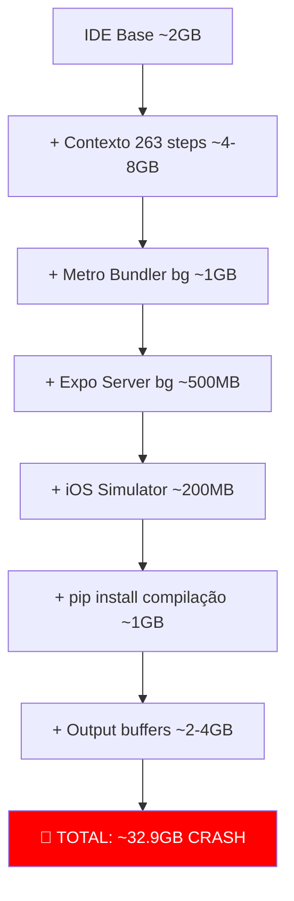

# 🔴 Análise do Travamento do macOS — Esgotamento de Memória (32.90 GB)

## Resumo Executivo

O Antigravity IDE consumiu **32.90 GB de RAM**, causando esgotamento total da memória do macOS e travando o sistema. A análise das duas conversas anteriores revela uma **tempestade perfeita** de fatores combinados.

---

## Evidências (Screenshot)

| Processo | Memória |
|---|---|
| **Antigravity IDE** | **32.90 GB** ⚠️ |
| Sublime Text | 601.8 MB |
| Google Chrome | 1.44 GB |
| Photos | 229.2 MB |
| Simulator (iOS) | 199.9 MB |
| DBeaver | 613.3 MB |
| Demais processos | ~150 MB |

> [!CAUTION]
> O IDE sozinho consumiu mais memória que todos os outros processos **combinados** (~35 GB total vs ~3 GB dos demais).

---

## 🔍 Causas Identificadas

### Causa 1: Conversa Massiva com 263+ Steps (Conversa `b6b6cea9`)

A conversa que travou o sistema executou:
- **103** respostas do modelo (PLANNER_RESPONSE)
- **41** comandos no terminal (RUN_COMMAND)
- **40** leituras de arquivo (VIEW_FILE)
- **29** edições de código (CODE_ACTION)
- **13** listagens de diretório
- **8** mensagens do usuário

> [!WARNING]
> Uma conversa com 263 steps acumula um contexto enorme na memória. Cada step armazena inputs, outputs, conteúdo de arquivos e resultados de comandos. Isso cresce exponencialmente.

### Causa 2: Encadeamento de Operações Pesadas Simultâneas

Na mesma conversa, foram executados **sequencialmente sem pausa**:

1. **`npm install`** na pasta app (Step 64) — já era a operação que causou o travamento anterior
2. **`pnpm install`** removendo e recriando node_modules (Step 55)
3. **`npx expo export --platform web`** — compilação web completa (Steps 148, 169)
4. **`npx expo start --ios`** — iniciou o Expo + Metro bundler + iOS Simulator (Step 200)
5. **`pip install -e ".[dev]"`** — instalação de dependências Python com compilação de extensões C (Step 264)
6. **Migrações SQL** via psql para Supabase (Steps 256, 258, 260)

> [!IMPORTANT]
> O comando final `pip install -e ".[dev]"` (que aparece na screenshot) estava rodando **enquanto o Expo/Metro bundler e o iOS Simulator ainda estavam ativos em background**. Cada um desses é um processo Node.js/native que consome centenas de MB a GBs de RAM.

### Causa 3: Processos Background Não Terminados

Os comandos lançados em steps anteriores (Expo server, Metro bundler) **continuaram rodando em background** enquanto novos comandos pesados eram executados. Isso criou um acúmulo de:

- Metro Bundler (Node.js) — ~500MB-1GB
- Expo Dev Server — ~200-500MB
- iOS Simulator — ~200MB (visível no screenshot)
- pip install compilando extensões C (Pillow, cryptography) — ~500MB-1GB
- O próprio IDE processando tudo — ~2-4GB base

### Causa 4: Conversa Anterior Já Tinha Alertado (Conversa `44e964b3`)

A conversa original (`44e964b3` — 174 steps) também executou operações pesadas:
- `npm install` na pasta app (Step 173) — **foi neste ponto que o primeiro travamento ocorreu**
- Criação de projeto Expo via `create-expo-app` (Step 120)
- Múltiplas instalações de pacotes (Steps 98, 100, 102)

### Causa 5: 93 Conversas Acumuladas

O diretório do IDE contém **93 conversas** acumuladas, consumindo 1.6 GB em disco. O IDE pode estar carregando metadados de todas essas conversas na memória.

---

## 📊 Diagrama de Acúmulo de Memória

---

## ✅ Recomendações para Nunca Mais Acontecer

### Para o Agente (regras que vou seguir a partir de agora):

| Regra | Ação |
|---|---|
| **1. Limitar tamanho da conversa** | Máximo ~50 steps por conversa. Sugerir nova conversa quando atingir esse limite |
| **2. NUNCA rodar npm/pnpm install sem limitar** | Usar `--prefer-offline`, verificar memória antes |
| **3. Matar processos background antes de novo comando pesado** | Sempre terminar Expo, Metro, dev servers antes de iniciar pip install ou outros |
| **4. Não executar compilações em paralelo** | Nunca rodar pip install + npm install + expo na mesma sessão sem esperar cada um terminar |
| **5. Verificar memória antes de operações pesadas** | Rodar `vm_stat` ou `memory_pressure` antes de instalar dependências |
| **6. Usar `--no-optional` em npm/pnpm** | Reduz drasticamente o uso de memória durante install |

### Para o Usuário:

| Ação | Impacto |
|---|---|
| **Fechar abas não usadas no Chrome** | Chrome estava com 1.44 GB |
| **Fechar DBeaver quando não estiver usando** | 613 MB |
| **Fechar Sublime Text se não estiver usando** | 601 MB |
| **Limpar conversas antigas do Antigravity** | 93 conversas = contexto acumulado |
| **Não rodar iOS Simulator junto com operações pesadas** | 200 MB + overhead do sistema |

---

## Estado Atual (Pós-Reinício)

Após o reinício, o IDE está consumindo **~2.12 GB** (normal). Nenhum processo pesado está rodando em background atualmente.
